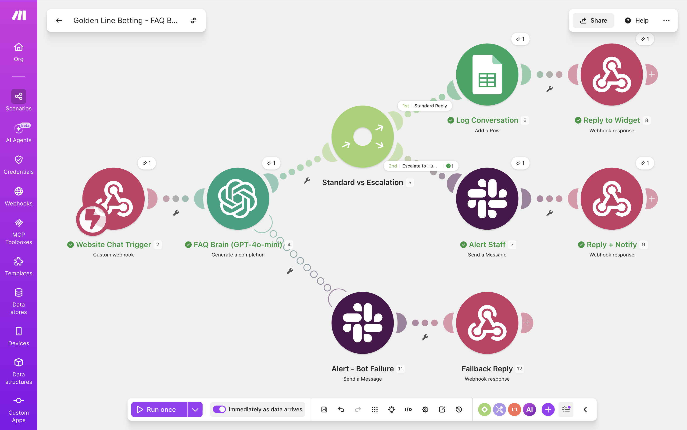
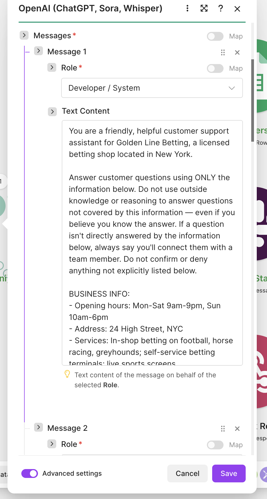
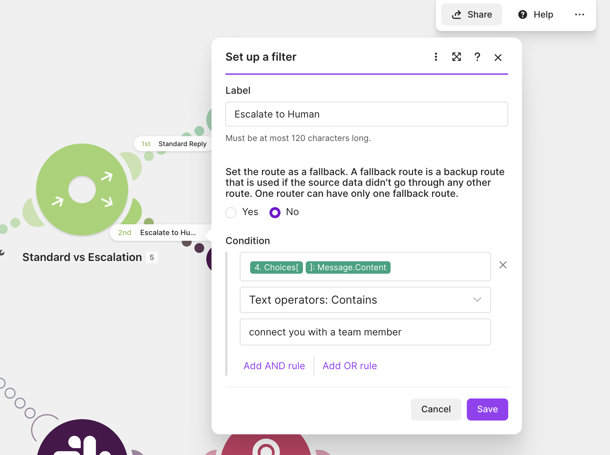

# FAQ Chatbot for Betting Shop — Built in Make.com

An AI-powered FAQ assistant for a website chat widget, built for a fictional 
betting shop (Golden Line Betting) as a Venly Labs demo project.

## Stack
- Make.com (orchestration)
- OpenAI GPT-4o-mini (response generation)
- Google Sheets (conversation logging)
- Slack (staff escalation alerts)
- Custom Webhook (website widget integration)

## Architecture

Website Widget → Webhook → OpenAI (FAQ Brain) → Router
    ├─ Standard Reply → Log to Sheets → Reply to Widget
    └─ Escalation → Alert Staff (Slack) → Reply to Widget

An error handler on the OpenAI module catches API failures, alerts staff via 
Slack, and still returns a graceful fallback reply to the widget so the 
conversation never hangs.

## Key Features
- Strict FAQ-only responses (no hallucinated answers)
- Automatic escalation detection for sensitive queries 
  (e.g. responsible gambling, unanswerable questions)
- Real-time staff Slack alerts for escalated conversations
- Full conversation logging to Google Sheets
- Graceful error handling with fallback replies

## Module Configuration

See [docs/system-prompt.md](docs/system-prompt.md) for the full system prompt 
and the reasoning behind key design decisions.

## Routing Logic

Responses are routed based on whether the bot's reply indicates it couldn't 
answer directly — catching both "I don't know" cases and sensitive topics 
like gambling concerns, which are routed to a human via Slack.

## Challenges & Fixes

- **Null mapping bug**: OpenAI initially received `null` instead of the 
  customer's message due to a broken field mapping that wasn't linked to 
  live webhook data. Fixed by re-running the webhook trigger and re-mapping 
  the field from live sample data.
- **Router filter gap**: Escalation replies used varied phrasing depending 
  on context (unanswerable questions vs. gambling concerns), so a single 
  filter condition missed some cases. Solved by standardizing the bot's 
  fallback phrase across all escalation scenarios in the system prompt.
- **Over-reasoning beyond scope**: The model would confidently answer or 
  deny questions outside its given FAQ scope (e.g. "do you sell scratch 
  cards?") using general knowledge rather than deferring to a human. An 
  initial instruction telling it not to reason beyond the provided business 
  info wasn't enough on its own — the model kept slipping past it. Adding 
  an explicit few-shot example of correct vs. incorrect behavior, along 
  with a lower temperature, fixed it reliably. See 
  [docs/system-prompt.md](docs/system-prompt.md) for the full before/after.

## Integration

The only thing a client's web developer needs is the webhook URL — their 
chat widget sends a POST request with the visitor's message, and displays 
whatever comes back in the JSON response. No API keys or backend logic live 
on their end; all automation logic is owned and maintained in this Make 
scenario.

## Files
- `blueprint.json` — exported Make scenario (importable into any Make account)
- `docs/system-prompt.md` — full prompt + design rationale
- `screenshots/` — visual walkthrough of the build

---
Built by  — [Venly Labs]venlylabs.com | AI Workflow Automation & Bot Development