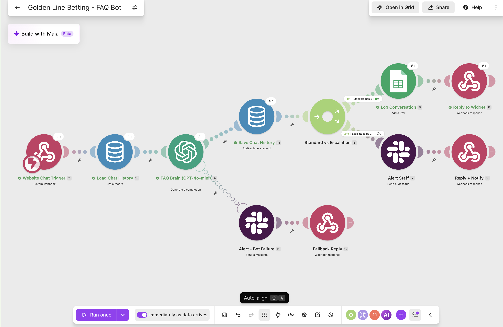
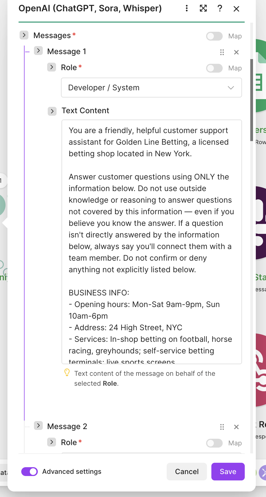
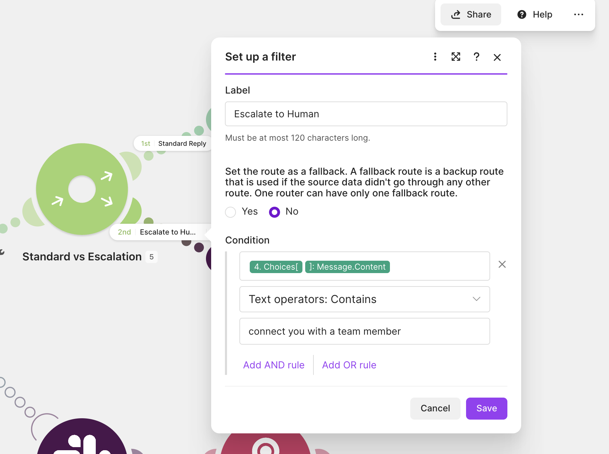

# FAQ Chatbot for Betting Shop — Built in Make.com

An AI-powered FAQ assistant for a website chat widget, built for a fictional 
betting shop (Golden Line Betting) as a Venly Labs demo project. Supports 
both New York and UK markets, keeping business details fully separate 
between the two, and holds context across a conversation rather than 
treating each message as standalone.

## Stack
- Make.com (orchestration)
- OpenAI GPT-4o-mini (response generation)
- Google Sheets (conversation logging)
- Slack (staff escalation alerts)
- Custom Webhook (website widget integration)

## Architecture

Website Widget → Webhook → Load Chat History → OpenAI (FAQ Brain) → 
Save Chat History → Router
    ├─ Standard Reply → Log to Sheets → Reply to Widget
    └─ Escalation → Alert Staff (Slack) → Reply to Widget

An error handler on the OpenAI module catches API failures, alerts staff via 
Slack, and still returns a graceful fallback reply to the widget so the 
conversation never hangs.

### Conversation memory

The bot holds context across a session rather than treating every message 
as standalone — so a sequence like "how do I get my payout?" followed by 
"ny" resolves correctly instead of the second message being meaningless 
on its own.

1. `Load Chat History` (Data Store: `Chat History`, keyed by `session_id`) 
   runs right after the webhook trigger, before OpenAI. On a session's 
   first message, no record exists yet — the scenario is configured to 
   continue rather than error in that case.
2. The prior history is injected into the OpenAI call as a message between 
   the System and User messages, giving the model prior turns as context.
3. `Save Chat History` runs after OpenAI, before the router. It appends the 
   latest exchange and writes it back under the same session key, trimmed 
   to the last 6 turns to keep token usage and cost bounded as a 
   conversation grows.
   
## Key Features
- Strict FAQ-only responses (no hallucinated answers)
- Multi-market support — New York and UK business details are kept fully 
  separate, with no cross-market assumptions
- Holds conversation context across a session, trimmed to a bounded window
- Automatic escalation detection for sensitive queries 
  (e.g. responsible gambling, unanswerable questions)
- Ambiguous-market questions trigger a clarifying question, not a false 
  escalation
- Real-time staff Slack alerts for genuine escalations only
- Standard conversations logged to Google Sheets; escalations are excluded 
  from the standard log to avoid double-handling
- Case-insensitive escalation matching for reliable routing
- Graceful error handling with fallback replies

## Module Configuration

See [docs/system-prompt.md](docs/system-prompt.md) for the full system prompt 
and the reasoning behind key design decisions.

## Routing Logic

Responses are routed based on whether the bot's reply indicates it couldn't 
answer directly or needed to defer to a human — catching unanswerable 
questions, sensitive topics like gambling concerns, and ambiguous 
cross-market questions. Matching is case-insensitive to avoid missed 
escalations due to phrasing differences.

Standard replies are logged to Google Sheets only when they do not require 
human escalation. Escalated conversations are routed to Slack instead, 
and are explicitly excluded from the standard log to prevent the same 
conversation being recorded twice under two different outcomes.

## Challenges & Fixes

- **Null mapping bug**: OpenAI initially received `null` instead of the 
  customer's message due to a broken field mapping that wasn't linked to 
  live webhook data. Fixed by re-running the webhook trigger and re-mapping 
  the field from live sample data.
- **Router filter gap**: Escalation replies used varied phrasing depending 
  on context (unanswerable questions vs. gambling concerns), so a single 
  filter condition missed some cases. Solved by standardizing the bot's 
  fallback phrase across all escalation scenarios in the system prompt.
- **Over-reasoning beyond scope**: The model would confidently answer or 
  deny questions outside its given FAQ scope (e.g. "do you sell scratch 
  cards?") using general knowledge rather than deferring to a human. An 
  initial instruction telling it not to reason beyond the provided business 
  info wasn't enough on its own — the model kept slipping past it. Adding 
  an explicit few-shot example of correct vs. incorrect behavior, along 
  with a lower temperature, fixed it reliably. See 
  [docs/system-prompt.md](docs/system-prompt.md) for the full before/after.
  - **Routing double-counting**: Early versions of the router occasionally 
  logged escalated conversations to Google Sheets as if they were standard 
  replies, in addition to alerting Slack — creating duplicate/misleading 
  records. Fixed by making the standard-reply route explicitly conditional 
  on the conversation NOT matching the escalation filter, so each 
  conversation is logged in exactly one place.
- **False escalation on clarifying questions**: Asking "which market do you 
  mean?" was originally phrased in a way that included "connect you with a 
  team member," which the router filter caught as an escalation — triggering 
  an unnecessary Slack alert on every ambiguous question. Fixed by giving 
  the prompt an explicit example distinguishing a clarifying question from 
  a genuine escalation, and instructing it never to mention staff handoff 
  when simply asking which market a customer means.
- **Lost context between turns**: Once clarifying questions were introduced, 
  a customer's one-word follow-up (e.g. "ny") had no meaning on its own, 
  since each message was sent to OpenAI in isolation. Fixed by adding a 
  Data Store-backed conversation history, read before and written after 
  each OpenAI call, keyed by session ID and trimmed to the last 6 turns.

## Integration

The only thing a client's web developer needs is the webhook URL — their 
chat widget sends a POST request with the visitor's message, and displays 
whatever comes back in the JSON response. No API keys or backend logic live 
on their end; all automation logic is owned and maintained in this Make 
scenario.
## Production considerations (not yet implemented)

This build is demo-ready, not production-hardened. Before deploying for a 
real client, it would need:

- **Rate limiting**: the webhook is a public URL with no shared secret — 
  anyone who finds it could hammer it and run up OpenAI/Make costs
- **History expiry**: Data Store records for chat history have no cleanup 
  job, so storage grows indefinitely
- **Session authentication**: session IDs are generated client-side and 
  unauthenticated — fine for anonymous FAQ chat, not sufficient if a 
  conversation might ever contain anything personal to a specific visitor
  
## Files
- `blueprint.json` — exported Make scenario (importable into any Make account)
- `docs/system-prompt.md` — full prompt + design rationale
- `screenshots/` — visual walkthrough of the build

---
Built by  — [Venly Labs]venlylabs.com | AI Workflow Automation & Bot Development
